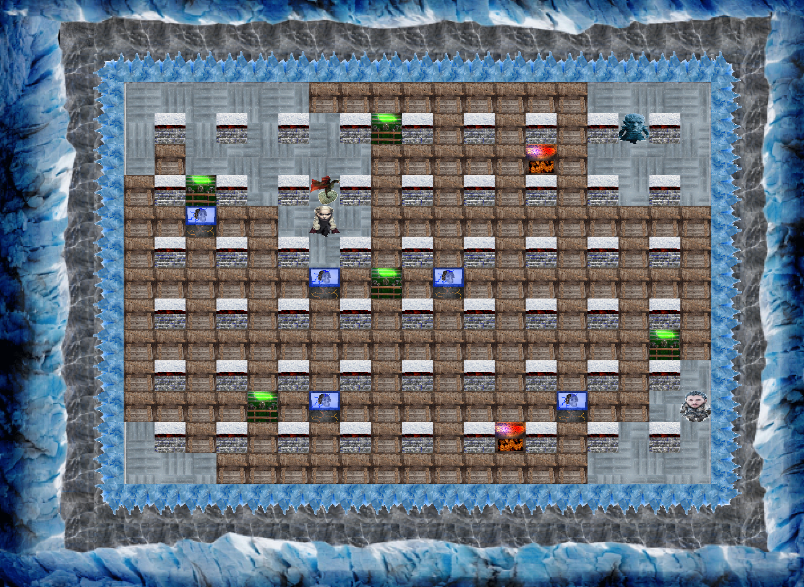

# Bomberman
**Jeu en Python avec la librairie PyQt5**

 

**Thème du jeu :** Game of Thrones
  
**Principe du jeu :** Poser des bombes pour tuer l'adversaire
 
    

**Fonctionnalités :**
- Possibilité de jouer à deux sur un même clavier
- Adversaire artificiel

  
  
**Personnage 1 (John Snow) :**
* Pour avancer : <kbd>↑</kbd> <kbd>↓</kbd> <kbd>←</kbd> <kbd>→</kbd>
* Pour déposer une bombe : <kbd>Entrée</kbd>

**Personnage 2 (Daenerys)  :**
* Pour se déplacer : <kbd>Z</kbd> <kbd>Q</kbd> <kbd>S</kbd> <kbd>D</kbd>
* Pour déposer une bombe : <kbd>Espace</kbd>

 
 

